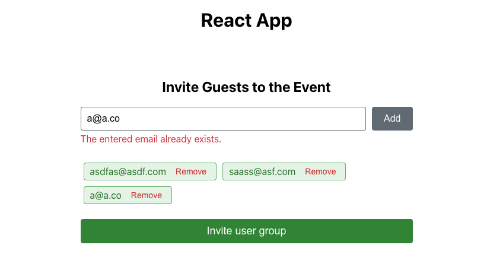

# Invite guests feature

This project implements the “Invite Guests” feature using React. It allows users to add guest emails, validates the inputs, prevents duplicates, and displays the list of invited guests with options to remove them. The interface is responsive and follows React best practices with a clean code structure.



## Getting Started

Prerequisites

- Node.js and npm installed on your machine.

### Installation

1. Clone the repo

   ```sh
   git clone https://github.com/yosvelquintero/invite-guests
   ```

2. Install NPM packages

   ```sh
     npm install
   ```

3. Start the project

   ```sh
   npm start
   ```

Open [http://localhost:3000](http://localhost:3000) in your browser to view the application.

## Testing

To ensure the quality and functionality of the "Invite Guests" feature, we have included a suite of unit and integration tests. Follow the steps below to run the tests:

### Running Tests

1. **Run Tests**

   Execute the following command to run all tests:

   ```sh
   npm run test
   ```

   This will run the tests using the configured test runner (e.g., Jest).

2. **View Test Coverage**

   ```sh
   npm run test:cov
   ```

   After running the tests, you can view the test coverage by opening the generated coverage report. The report is located in the `coverage` directory.

3. **Open Coverage Report**

   ```sh
   open coverage/lcov-report/index.html
   ```

This will open the coverage report in your default browser.

## Features

- Add Guest Emails: Users can input email addresses to invite guests.
- Email Validation: Ensures that the entered email addresses are in the correct format.
- Duplicate Prevention: Checks for and prevents duplicate email entries.
- Responsive Design: Optimized for various screen sizes, including mobile devices.
- User Interface: Modern and clean UI using CSS variables and consistent theming.

### Project Structure

Components:

- `components/app`

  - **App**: Main component that renders the application.

- `components/invite-guests`

  - **InviteGuests**: Main component that manages the email list and input field.
  - **EmailInput**: Handles the email input field and validation messages.
  - **EmailChip**: Displays individual invited emails with a remove option.
  - **InvitedEmailsList**: Renders the list of invited emails.
  - **InviteGuestsButton**: Displays the “Invite Guests” button.

hocs:

- **withEmailManagement**: Higher-order component that provides email management functionality to child components.

Hooks:

- **useEmailManagement**: Manages email state, validation, and duplication checks.

Styles:

- Uses CSS variables defined in index.css for consistent theming.
- Responsive styles are handled in InviteGuests.css.

Technologies Used

- [React](https://react.dev/): JavaScript library for building user interfaces.
- [TypeScript](https://www.typescriptlang.org/): Typed superset of JavaScript that compiles to plain JavaScript.
- [Jest](https://jestjs.io/): JavaScript testing framework.

## Stay in touch

- Author - [Yosvel Quintero](https://x.com/yosvelquintero)

## License

This project is open-source and available under the [MIT License](https://opensource.org/license/mit).
